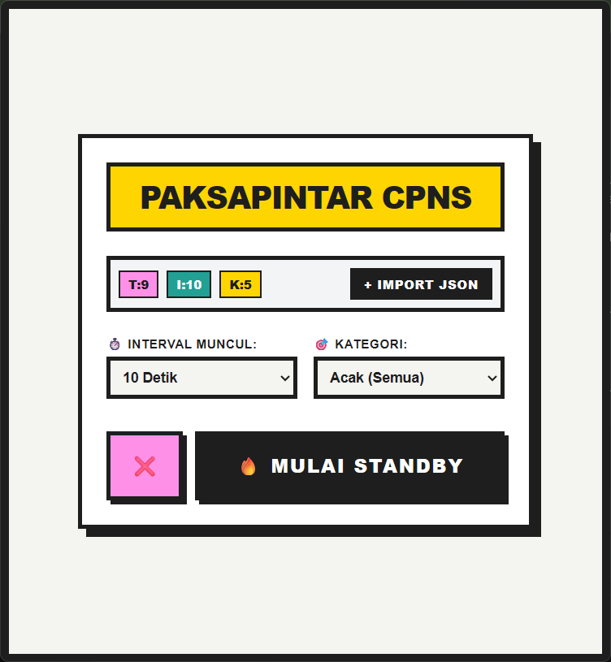
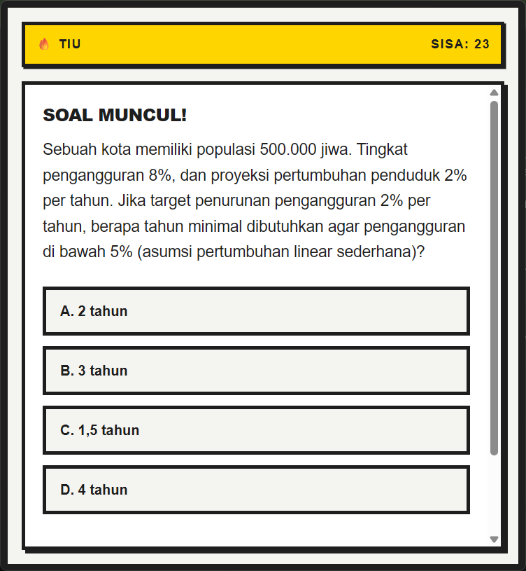
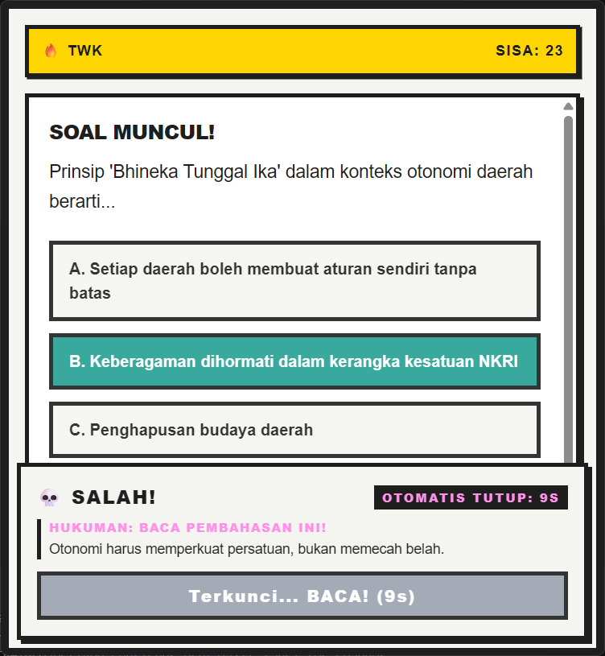
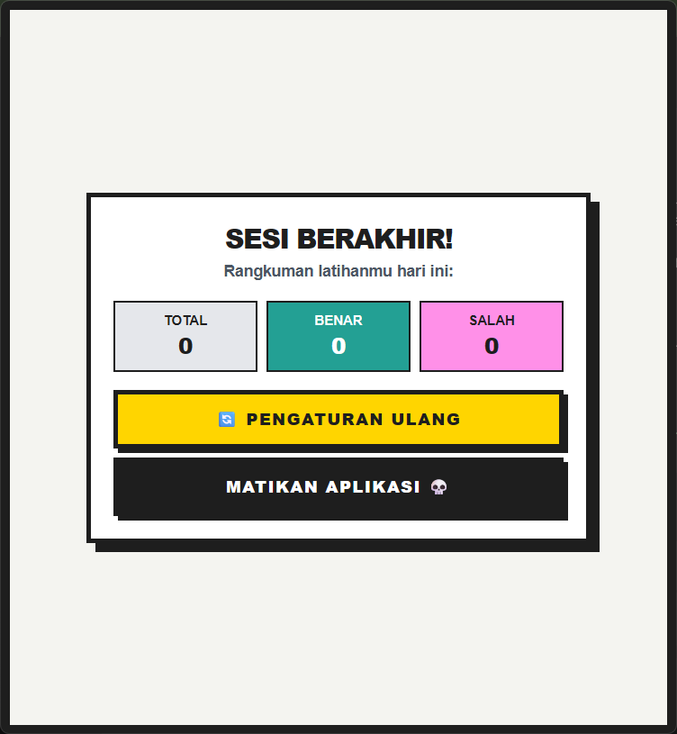

# 🚨 PaksaPintar CPNS (Teror Belajar Desktop)


Aplikasi Desktop Windows berdesain **Neo-Brutalism** yang memaksa Anda belajar CPNS. Aplikasi ini berjalan sangat ringan di *background* (System Tray) dan akan **menginterupsi layar Anda secara tiba-tiba** untuk memberikan 1 soal CPNS (TWK, TIU, atau TKP).

Anda **TIDAK BISA** menutup aplikasinya sebelum menjawab soal tersebut! 💀

---

## 📸 Preview Aplikasi
### 1. Menu Pengaturan (Neo-Brutalism UI)
<br>
*Antarmuka pengaturan yang tegas, menampilkan statistik soal dan kontrol interval waktu munculnya pop-up.*

### 2. Interupsi Soal Secara Tiba-Tiba
<br>
*Soal akan muncul memaksa di atas semua aplikasi (Always-on-top).*

### 3. Hukuman Brutal (Cooldown Penalty)
<br>
*Jika menjawab salah, tombol tutup akan dikunci selama 15 detik. Memaksa pengguna membaca pembahasan.*

### 4. Rapor Evaluasi Akhir Sesi
<br>
*Menampilkan log soal mana saja yang dijawab salah sebagai bahan evaluasi sebelum aplikasi dimatikan sepenuhnya.*

---

## 🔥 Fitur Utama
- **Always-On-Top Interruption:** Sistem akan menembus dan menutupi layar apa pun yang sedang Anda kerjakan.
- **Brutal Cooldown Penalty:** Menjawab salah = tombol Tutup ditahan 15 detik. Tidak ada celah untuk malas membaca pembahasan.
- **Log Evaluasi:** Rapor cerdas di akhir sesi yang mencatat spesifik pertanyaan yang Anda jawab salah hari ini.
- **Custom Bank Soal (JSON Import):** Tidak perlu *coding* untuk menambah soal. Pengguna bisa mengimpor file `.json` berisi bank soal dan menyimpannya secara permanen di *Local Storage*.
- **Zero-Bloat Background Process:** Dibangun dengan **Rust (Tauri v2)**, aplikasi ini nyaris tidak mengonsumsi RAM saat bersembunyi di *System Tray*.

## 🛠️ Cara Instalasi (Development)

Pastikan sistem Anda telah terinstal `Node.js`, `Rust`, dan `C++ Build Tools` (Windows).

1. Clone repositori ini:
   ```bash
   [git clone [[https://github.com/USERNAME_KAMU/paksapintar-cpns.git](https://github.com/USERNAME_KAMU/paksapintar-cpns.git)](https://github.com/M-Rafif-Musyaffa/PaksaPintar-cpns.git)](https://github.com/M-Rafif-Musyaffa/PaksaPintar-cpns.git)
   ```
2. Masuk ke direktori proyek:
 ```bash
   cd paksapintar-cpns
   ```
3. Install dependencies frontend:
    ```bash
   npm install
   ```
4. Jalankan aplikasi di mode pengembangan:
    ```bash
   npm run tauri dev
   ```

## 📦 Build ke Production (.exe / .msi)
Untuk mengemas aplikasi menjadi installer Windows yang siap dibagikan:
```bash
npm run tauri build
```
File installer akan otomatis terbuat di dalam folder src-tauri/target/release/bundle/msi/

## 📂 Format Import JSON Soal
Bagi pengguna yang ingin memasukkan soal dari luar, format .json harus berbentuk Array of Objects seperti berikut:
```bash
[
  {
    "id": 1,
    "kategori": "TWK",
    "pertanyaan": "Kapan BPUPKI dibentuk?",
    "pilihan": ["A. 1 Maret 1945", "B. 29 Mei 1945", "C. 18 Agustus 1945"],
    "jawaban_benar": "A",
    "pembahasan": "BPUPKI dibentuk secara resmi pada 1 Maret 1945."
  }
]
```
Dibangun dengan rasa frustrasi karena sering lupa jadwal belajar. Solusi masalah nyata lewat kode nyata.

   
